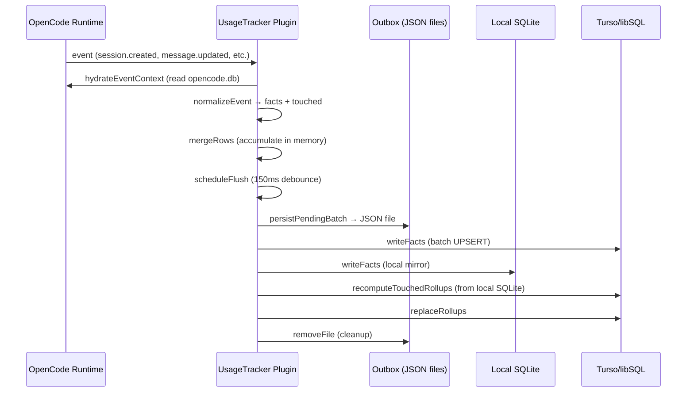
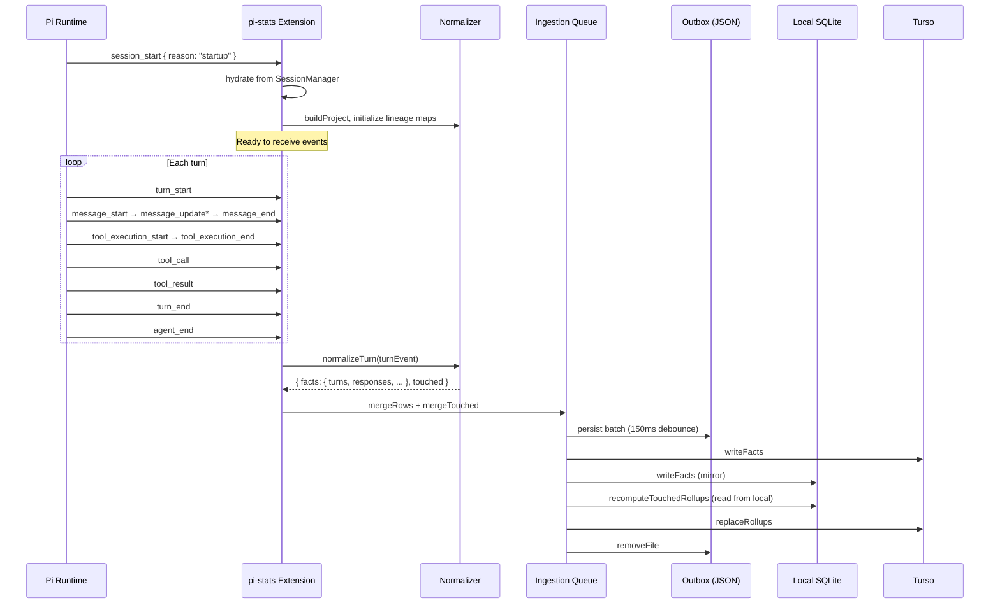

# Pi Usage Tracker — Implementation Plan

## 1. Goal

Port the OpenCode usage-tracker plugin to Pi, so Pi sessions produce the same analytics (session counts, token usage, costs, tool activity, per-model rollups, daily aggregates) written to a Turso/libSQL database.

## 2. Starting Point, Driving Problem, and Finish Line

**Starting point:** The OpenCode stats plugin (`opencode-stats-plugin`) captures project, session, message, response, turn, tool-call, and LLM-step data from OpenCode's runtime event stream. It hydrates session lineage from OpenCode's local SQLite database, normalizes events into fact rows, persists them through a durable JSON outbox on disk, writes them to Turso, and recomputes materialized rollup tables.

**Driving problem:** Pi has a different event model (typed `pi.on()` hooks vs. OpenCode's `event`/`tool.execute.before` hooks), a different session storage format (JSONL files vs. SQLite), and a different extension lifecycle. The analytics pipeline needs to be adapted to Pi's surface area while preserving the same analytical output.

**Finish line:** A Pi extension that:
- Subscribes to Pi's session, message, turn, tool, and agent events
- Hydrates session lineage from Pi's `SessionManager` (JSONL files)
- Normalizes Pi events into the same fact table shapes
- Persists facts through a durable JSON outbox
- Writes to Turso and recomputes rollups
- Exposes maintenance commands via `pi.registerCommand()`

## 3. Constraints and Assumptions

### Constraints
- Pi extensions run on Node.js, not Bun (no `bun:sqlite`, no Bun-native APIs)
- Pi's `@libsql/client` works fine since it's a pure JS HTTP client
- The Turso schema and rollup logic can remain unchanged
- Pi extensions use npm for dependency management
- Pi sessions are JSONL files managed by `SessionManager`; there is no `opencode.db`

### Verified (was: Assumptions)
1. ✅ **Pi event shapes carry enough data for all fact columns.** — Confirmed via type inspection of `@earendil-works/pi-coding-agent/dist/core/extensions/types.d.ts` and `@earendil-works/pi-ai/dist/types.d.ts`. See Section 5a for the full mapping.
2. ✅ **Pi session JSONL files provide session lineage.** — The `SessionHeader` type includes `parentSession` (path to parent session file). `ReadonlySessionManager` exposes `getHeader()`, `getEntries()`, `getSessionFile()`, and tree navigation.
3. ✅ **`SessionManager` is available via `ctx.sessionManager`.** — The `ExtensionContext` type includes `sessionManager: ReadonlySessionManager`.
4. ✅ **Project identity is derived from `cwd`.** — Pi has no explicit "project" object; use `ctx.cwd` as `worktree`, derive VCS from `.git` presence, and use `path.basename(cwd)` as project name.
5. ✅ **`ExtensionContext` provides `cwd`, `sessionManager`, `model`, `signal`.** — Confirmed in `ExtensionContext` type definition.

## 4. Current State (OpenCode Plugin Architecture)

### 4.1 Entry Point

```
plugins/usage-tracker/index.js  →  exports UsageTracker factory
```

The factory receives `{ project }` and returns an object with hook handlers:
- `event` — primary ingestion hook
- `tool.execute.after` — annotates tool output titles
- `command.execute.before` — flushes on `exit`
- `tool.execute.before` — flushes before maintenance tools run

### 4.2 Core Pipeline

```
Event arrives
    → hydrateEventContext (fills in missing session/message data from opencode.db)
    → normalizeEvent (event → { facts, touched })
    → mergeRows (accumulate in pendingFacts Map-of-Maps)
    → scheduleFlush (150ms debounce)
    → persistPendingBatch (write to ~/.local/share/opencode/usage-outbox/<pid>/<seq>-<uuid>.json)
    → drainJournalQueue (read outbox files, write facts to Turso + local SQLite)
    → scheduleRollupFlush (15s debounce)
    → recomputeTouchedRollups (read from local SQLite, run rollup SQL against Turso)
    → replaceRollups (write rollup rows back to Turso)
```

### 4.3 Data Flow Diagram



### 4.4 Module Map

| Module | Purpose |
|--------|---------|
| `plugins/usage-tracker/index.js` | Entry point, hooks wiring |
| `plugins/usage-tracker/normalize.js` | Event → fact rows + touch tracking |
| `plugins/usage-tracker/queue.js` | In-memory accumulation, outbox persistence, Turso writes, rollup scheduling |
| `plugins/usage-tracker/history.js` | Hydrate session/message state from `opencode.db` |
| `src/analytics/schema.js` | Table definitions, UPSERT SQL, primary keys |
| `src/analytics/derive.js` | Backfill: parse raw DB data into fact rows |
| `src/analytics/turso.js` | Turso client, schema init, write/read |
| `src/analytics/rollups.js` | Incremental and full rollup recomputation |
| `src/analytics/outbox.js` | Durable JSON file persistence |
| `src/analytics/local-sqlite.js` | Local SQLite mirror for fast rollup reads |
| `src/analytics/opencode-db.js` | Read OpenCode's SQLite for backfill |
| `src/analytics/upsert.js` | Batch UPSERT helpers |
| `src/analytics/report.js` | Markdown/JSONL report generation |
| `src/analytics/utils.js` | Byte counting, stable stringify, sleep, etc. |
| `src/commands/*.js` | Maintenance command implementations |

### 4.5 Fact Tables (8 tables)

`projects`, `sessions`, `turns`, `responses`, `response_parts`, `llm_steps`, `tool_calls`, `tool_payloads`

### 4.6 Rollup Tables (9 tables)

`session_rollups`, `session_model_rollups`, `project_rollups`, `project_model_rollups`, `tool_rollups`, `daily_global_rollups`, `daily_model_rollups`, `daily_tool_rollups`, `daily_project_rollups`

## 5. What Is Actually Causing the Adaptation Challenge

Four structural differences between OpenCode and Pi force changes to the plugin:

### 5.1 Event Model Mismatch

OpenCode emits a single generic `event` hook with `event.type` discriminating the actual event (`session.created`, `message.updated`, `message.part.updated`, etc.). Pi uses typed, named events:
- `session_start` / `session_shutdown`
- `tool_execution_start` / `tool_execution_end`
- `tool_call` / `tool_result`
- `message_start` / `message_update` / `message_end`
- `turn_start` / `turn_end`
- `agent_start` / `agent_end`
- `before_agent_start`

Pi's events carry different shapes than OpenCode's `event.properties`. The normalizer must be rewritten to map Pi event shapes into the same fact row shapes.

**Why this changes the plan:** The normalizer and the event subscription wiring are the two largest rewrites needed. The schema, Turso, outbox, and rollup modules can remain nearly unchanged.

### 5.2 Session Storage Format

OpenCode stores sessions in a SQLite database (`opencode.db`) with `session`, `message`, and `part` tables. The plugin queries this for hydration (backfilling missing session lineage when an event arrives for a session that started before the plugin loaded).

Pi stores sessions as JSONL files via `SessionManager`. The `SessionManager` API provides `getEntries()`, `getBranch()`, etc. For backfill, the plugin would need to parse all session JSONL files in the sessions directory. For hydration (live event processing), the `ctx.sessionManager` and `session_start` events carry enough context.

**Why this changes the plan:** The hydration module (`history.js`) can be simplified — Pi's `session_start` event likely provides all session metadata at startup. The backfill command needs a JSONL parser instead of `bun:sqlite`.

### 5.3 No Built-in SQLite

OpenCode's plugin uses `bun:sqlite` for two purposes:
1. Reading `opencode.db` for hydration and backfill
2. Maintaining a local SQLite mirror (`analytics.db`) for fast rollup reads

Pi runs on Node.js where `bun:sqlite` is unavailable. The local SQLite mirror can use `better-sqlite3` (the standard Node.js SQLite binding) or `@libsql/client` pointed at a local file path (which already works — the plugin already uses `@libsql/client` for the local mirror in `local-sqlite.js`).

**Why this changes the plan:** The local SQLite module (`local-sqlite.js`) needs a dependency swap from `bun:sqlite` → `better-sqlite3` (which isn't already in deps), or we can keep using `@libsql/client` for the local file (it already does this via `createClient({ url: "file:..." })`). *Confirmed:* The current `local-sqlite.js` already uses `@libsql/client` with `file:` URLs, not `bun:sqlite`. Only `opencode-db.js` and `history.js` use `bun:sqlite` to read OpenCode's database. Those two modules are the only ones being fully replaced.

### 5.4 Extension Lifecycle

OpenCode plugins return an object with named hook handlers. Pi extensions use `pi.on("event_name", handler)` with a default-exported factory. Tools use `pi.registerTool()` and commands use `pi.registerCommand()`.

**Why this changes the plan:** The entry point wiring changes from object-return to event-subscription style. This is mechanical but pervasive.

### 5.5 Maintenance Commands vs Tools

OpenCode's plugin exposes maintenance operations as *tools* (callable by the LLM). Pi supports both `pi.registerTool()` and `pi.registerCommand()`. For maintenance operations, Pi commands (triggered by the user typing `/usage-flush`, etc.) are a more natural fit than tools. However, we can register both — tools so the LLM can request maintenance, commands for direct user control.

## 5a. Verified Pi Event → Fact Row Mapping

*Source: `@earendil-works/pi-coding-agent/dist/core/extensions/types.d.ts` and `@earendil-works/pi-ai/dist/types.d.ts`*

The following table maps each Pi event to the fact rows it can produce, with the exact property paths confirmed from Pi's TypeScript definitions.

### 5a.1 Project → `projects` table

| Fact Column | Pi Source | Type Path |
|-------------|-----------|-----------|
| `id` | Project slug derived from `cwd` | `path.basename(ctx.cwd)` |
| `worktree` | Current working directory | `ctx.cwd` |
| `vcs` | Detect `.git` directory | `fs.existsSync(join(ctx.cwd, '.git')) ? 'git' : null` |
| `name` | Project name | `path.basename(ctx.cwd)` |
| `time_created`, `time_updated` | Session start timestamp | `Date.now()` at first `session_start` |

### 5a.2 Session → `sessions` table

| Fact Column | Pi Source | Type Path |
|-------------|-----------|-----------|
| `id` | Session ID | `ctx.sessionManager.getSessionId()` |
| `project_id` | Project slug | Derived from `cwd` |
| `parent_session_id` | Parent session file path | `ctx.sessionManager.getHeader().parentSession` |
| `root_session_id` | Lineage resolution | Walk `parentSession` chain |
| `slug` | Session directory name | `path.basename(ctx.sessionManager.getSessionDir())` |
| `directory` | Session cwd | `ctx.sessionManager.getCwd()` / `SessionHeader.cwd` |
| `title` | Session file basename | `path.basename(ctx.sessionManager.getSessionFile())` |
| `version` | Session format version | `SessionHeader.version` (default `CURRENT_SESSION_VERSION = 3`) |
| `time_created`, `time_updated` | `session_start` event | `Date.now()` at event |

### 5a.3 Turn → `turns` table

| Fact Column | Pi Source | Type Path |
|-------------|-----------|-----------|
| `id` | Entry ID of the user message | `SessionMessageEntry.id` (from `session_start` hydration or `message_end` for user messages) |
| `session_id` | Active session | `ctx.sessionManager.getSessionId()` |
| `project_id` | Project slug | Derived from `cwd` |
| `content` | User message text | `UserMessage.content` — if string, use directly; if array, concatenate `TextContent.text` parts |
| `synthetic` | Not directly in Pi events | Set `0` for normal turns; Pi has no "synthetic" concept but compaction turns can be detected via `session_compact` |
| `compaction` | Detect from compaction events | `session_compact` → set `compaction = 1` for the compaction entry |
| `time_created`, `time_updated` | Message timestamps | `UserMessage.timestamp` (milliseconds since epoch, number) |
| `turn_duration_ms` | `turn_end.timestamp - turn_start.timestamp` | `TurnEndEvent.timestamp - TurnStartEvent.timestamp` (but `TurnEndEvent` doesn't have timestamp directly — use `Date.now()` at event, or the assistant message's `timestamp`) |

**Confirmed:** Pi's `UserMessage` has:
```typescript
export interface UserMessage {
    role: "user";
    content: string | (TextContent | ImageContent)[];  // text content
    timestamp: number;                                     // ms epoch
}
```

### 5a.4 Response → `responses` table

| Fact Column | Pi Source | Type Path |
|-------------|-----------|-----------|
| `id` | Entry ID of the assistant message | `SessionMessageEntry.id` |
| `turn_id` | Parent user message ID | Not directly encoded in `AssistantMessage`; must be tracked from `turn_start`/`turn_end` pairing |
| `session_id` | Active session | `ctx.sessionManager.getSessionId()` |
| `project_id` | Project slug | Derived from `cwd` |
| `agent` | Not in Pi types | Set `null` or extract from model name |
| `provider_id` | Model provider | `AssistantMessage.provider` (e.g., `"anthropic"`, `"openai"`) |
| `model_id` | Model ID | `AssistantMessage.model` (e.g., `"claude-sonnet-4-20250514"`) |
| `summary` | Not in Pi events | Set `0` (OpenCode had a `summary` boolean) |
| `finish` | Stop reason | `AssistantMessage.stopReason` — `"stop"` | `"length"` | `"toolUse"` | `"error"` | `"aborted"` |
| `error_type`, `error_message` | Error info | `AssistantMessage.errorMessage` (string, present when `stopReason` is `"error"` or `"aborted"`) |
| `cost` | Cost total | `AssistantMessage.usage.cost.total` (number, USD) |
| `tokens_in` | Input tokens | `AssistantMessage.usage.input` |
| `tokens_out` | Output tokens | `AssistantMessage.usage.output` |
| `tokens_reasoning` | Thinking tokens | `AssistantMessage.usage` has `input`/`output`/`cacheRead`/`cacheWrite` but **no separate `reasoning` field**. Pi's `Usage` type does NOT break out reasoning tokens separately from output. |
| `tokens_cache_read` | Cache read tokens | `AssistantMessage.usage.cacheRead` |
| `tokens_cache_write` | Cache write tokens | `AssistantMessage.usage.cacheWrite` |
| `time_created` | Message timestamp | `AssistantMessage.timestamp` |
| `time_completed` | Not directly in Pi events | Use `message_end` event time or `assistantMessage.timestamp` (which is when the stream completed) |
| `response_time_ms` | Turn wall time | `turn_end` timestamp minus `turn_start` timestamp |

**Confirmed:** Pi's `AssistantMessage` has:
```typescript
export interface AssistantMessage {
    role: "assistant";
    content: (TextContent | ThinkingContent | ToolCall)[];
    api: Api;
    provider: Provider;       // e.g., "anthropic"
    model: string;              // e.g., "claude-sonnet-4-20250514"
    usage: Usage;               // { input, output, cacheRead, cacheWrite, totalTokens, cost: {...} }
    stopReason: StopReason;     // "stop" | "length" | "toolUse" | "error" | "aborted"
    errorMessage?: string;
    timestamp: number;
}

export interface Usage {
    input: number;
    output: number;
    cacheRead: number;
    cacheWrite: number;
    totalTokens: number;
    cost: {
        input: number;
        output: number;
        cacheRead: number;
        cacheWrite: number;
        total: number;
    };
}
```

**⚠️ Gap:** Pi's `Usage` type does not have a `reasoning` token field. The `tokens_reasoning` column in the fact table must be `0` for Pi data. The OpenCode plugin extracts reasoning tokens from `message.tokens.reasoning`. In Pi, thinking/reasoning tokens are included in `output` (some providers break them out, but the Pi `Usage` type doesn't expose a separate field).

### 5a.5 Response Parts → `response_parts` table

Response parts capture the text/reasoning content blocks from assistant messages.

| Fact Column | Pi Source | Type Path |
|-------------|-----------|-----------|
| `response_id` | Assistant message entry ID | `SessionMessageEntry.id` |
| `part_id` | Content block index + type | Composite key from `content` array position |
| `part_type` | "text" or "reasoning" | `TextContent.type === "text"` → `"text"`; `ThinkingContent.type === "thinking"` → `"reasoning"` |
| `sort_key` | Content array index | Position in `AssistantMessage.content[]` |
| `content` | Text content | `TextContent.text` or `ThinkingContent.thinking` |
| `size_bytes` | Byte length | `Buffer.byteLength(content, 'utf8')` |

**Confirmed:** Pi's `AssistantMessage.content` is `(TextContent | ThinkingContent | ToolCall)[]`.

```typescript
export interface TextContent {
    type: "text";
    text: string;
}
export interface ThinkingContent {
    type: "thinking";
    thinking: string;
    redacted?: boolean;  // When true, content is encrypted — skip these
}
```

### 5a.6 LLM Steps → `llm_steps` table

| Fact Column | Pi Source | Type Path |
|-------------|-----------|-----------|
| `id` | Not directly in Pi events | Generate a synthetic step ID based on response + index |
| `response_id` | Assistant message entry ID | `SessionMessageEntry.id` |
| `session_id` | Active session | `ctx.sessionManager.getSessionId()` |
| `project_id` | Project slug | Derived from `cwd` |
| `provider_id` | Model provider | `AssistantMessage.provider` |
| `model_id` | Model ID | `AssistantMessage.model` |
| `finish_reason` | Stop reason | `AssistantMessage.stopReason` |
| `cost` | Cost total | `AssistantMessage.usage.cost.total` |
| `tokens_in/out` | Token counts | `AssistantMessage.usage.{input,output}` |
| `tokens_reasoning` | Not available | `0` |
| `tokens_cache_read/write` | Cache tokens | `AssistantMessage.usage.{cacheRead,cacheWrite}` |
| `time_created` | Turn start | `TurnStartEvent.timestamp` |
| `time_updated` | Turn end | `TurnEndEvent` timestamp (use `Date.now()` at event) |

**⚠️ Gap:** Pi does not emit `step-start` / `step-finish` events like OpenCode. The entire assistant response is a single "step" from Pi's perspective. The OpenCode plugin creates one `llm_step` per `step-finish` part within a message. For Pi, create one `llm_step` per assistant message response.

### 5a.7 Tool Calls → `tool_calls` table

| Fact Column | Pi Source | Type Path |
|-------------|-----------|-----------|
| `id` | Tool call ID | `ToolExecutionEndEvent.toolCallId` (unique per execution) |
| `response_id` | Parent assistant message entry ID | Track from `turn_start`/`turn_end` pairing |
| `session_id` | Active session | `ctx.sessionManager.getSessionId()` |
| `project_id` | Project slug | Derived from `cwd` |
| `step_id` | LLM step ID | Synthetic step covering this response |
| `call_id` | Tool call ID from assistant | `ToolCall.id` from `AssistantMessage.content[].id` |
| `tool` | Tool name | `ToolExecutionEndEvent.toolName` (e.g., `"bash"`, `"read"`, `"edit"`) |
| `status` | Execution result status | `ToolExecutionEndEvent.isError ? "error" : "success"` |
| `title` | Not directly available | Derived from tool type or `ToolExecutionEndEvent.result.details` |
| `error` | Error information | `ToolExecutionEndEvent.isError` — extract from `result.content` |
| `input_bytes` | Input size | `Buffer.byteLength(JSON.stringify(ToolExecutionStartEvent.args), 'utf8')` |
| `output_bytes` | Output size | `Buffer.byteLength(JSON.stringify(ToolExecutionEndEvent.result.content), 'utf8')` |
| `started_at` | Tool execution start | `ToolExecutionStartEvent` timestamp (use `Date.now()` at event) |
| `completed_at` | Tool execution end | `ToolExecutionEndEvent` timestamp (use `Date.now()` at event) |
| `duration_ms` | Duration | `completed_at - started_at` |
| `time_updated` | Last update | `Date.now()` at `tool_execution_end` |

**Confirmed:** Pi's tool events carry:
```typescript
export interface ToolExecutionStartEvent {
    type: "tool_execution_start";
    toolCallId: string;
    toolName: string;
    args: any;                // Tool arguments (untyped)
}

export interface ToolExecutionEndEvent {
    type: "tool_execution_end";
    toolCallId: string;
    toolName: string;
    result: any;              // Tool result object
    isError: boolean;
}
```

### 5a.8 Tool Payloads → `tool_payloads` table

| Fact Column | Pi Source | Type Path |
|-------------|-----------|-----------|
| `tool_call_id` | Same as `tool_calls.id` | `ToolExecutionEndEvent.toolCallId` |
| `payload_type` | "input" or "output" | Two rows per tool execution |
| `content` | JSON-serialized args/result | `JSON.stringify(ToolExecutionStartEvent.args)` for input; `JSON.stringify(ToolExecutionEndEvent.result.content)` for output |
| `size_bytes` | Byte length | Same as `input_bytes`/`output_bytes` in `tool_calls` |

### 5a.9 Touch Tracking (for Rollup Invalidation)

The existing touch tracking system tracks which dimensions need rollup recomputation:
- `projectIDs` — from `cwd`-derived project slug
- `sessionIDs` — from `ctx.sessionManager.getSessionId()` and lineage
- `rootSessionIDs` — from lineage resolution
- `days` — `new Date(timestamp).toISOString().slice(0, 10)` from event timestamps
- `modelKeys` — `[day, modelID, providerID]` tuples from assistant message model info
- `toolKeys` — `[day, toolName]` tuples from tool executions

All of these can be derived from the confirmed Pi event fields.

### 5a.10 Summary of Confirmed Fields vs. OpenCode

| Data Element | OpenCode Source | Pi Source | Status |
|--------------|----------------|-----------|--------|
| Model provider | `info.providerID` | `AssistantMessage.provider` | ✅ Direct |
| Model ID | `info.modelID` | `AssistantMessage.model` | ✅ Direct |
| Token input | `info.tokens.input` | `AssistantMessage.usage.input` | ✅ Direct |
| Token output | `info.tokens.output` | `AssistantMessage.usage.output` | ✅ Direct |
| Token reasoning | `info.tokens.reasoning` | **Not available** | ⚠️ Set to 0 |
| Cache read | `info.tokens.cache.read` | `AssistantMessage.usage.cacheRead` | ✅ Direct |
| Cache write | `info.tokens.cache.write` | `AssistantMessage.usage.cacheWrite` | ✅ Direct |
| Cost | `info.cost` | `AssistantMessage.usage.cost.total` | ✅ Direct |
| Finish reason | `info.finish` | `AssistantMessage.stopReason` | ✅ Direct |
| Error info | `info.error.name/message` | `AssistantMessage.errorMessage` | ✅ String only (no name/message split) |
| Turn content (user) | `part.text` (from part updates) | `UserMessage.content` | ✅ Direct |
| Turn synthetic flag | `part.synthetic` | Not in Pi | ⚠️ Set to 0; use `session_compact` for compaction detection |
| Turn compaction | `part.type === "compaction"` | `session_compact` event | ✅ Via `session_compact` event |
| Turn duration | `turn.completedAt - turn.createdAt` | `turn_end` minus `turn_start` | ✅ Via event-timestamp differencing |
| Tool start/end times | `state.time.start/end` | `tool_execution_start`/`tool_execution_end` event times | ✅ Via `Date.now()` at events |
| Tool input/output | `state.input/output` | `ToolExecutionStartEvent.args` / `ToolExecutionEndEvent.result` | ✅ Direct but untyped |
| LLM steps | Per `step-finish` part | One per assistant response | ⚠️ Coarser granularity |

**Key finding:** Pi provides all critical data (tokens, cost, model, finish, tool activity) through well-typed events. Two small gaps exist (reasoning tokens and step granularity), both handled with sensible defaults.

## 6. Intuition and Mental Model

Pi's event stream is richer but structurally different from OpenCode's. The key insight:

- **OpenCode:** One `event` hook, many `event.type` values. The plugin dispatches internally via `switch(event.type)`.
- **Pi:** Separate `pi.on()` calls for each event kind. Each handler receives a typed event.

The normalization logic (mapping event data to fact rows) is the *same transformation* — it's just that the input shapes differ. The `normalize.js` module can be restructured as a set of per-event-type normalizer functions, each producing the same `{ facts, touched }` output.

For hydration: Pi's `session_start` event fires for every session, including sessions restored on startup. This replaces the need to query a SQLite database. Each `session_start` event carries `sessionManager` in context, from which we can derive project ID, session lineage, etc.

For backfill: Pi sessions are JSONL files under `~/.pi/sessions/<project-slug>/`. A backfill command parses these files, derives facts (similar to the existing `derive.js` but from JSONL instead of SQLite rows), and writes them to Turso.

## 7. Options Considered

### Option A: Minimal Port (keep architecture, adapt surface)

Port the plugin by:
- Replacing `plugins/usage-tracker/index.js` with a Pi extension entry point
- Replacing the OpenCode event dispatch with Pi's `pi.on()` calls
- Replacing `history.js` with Pi's `SessionManager` API
- Replacing `opencode-db.js` with a JSONL session parser
- Dropping `bun:sqlite` dependency (already only used in the two modules being replaced)
- Keeping `schema.js`, `turso.js`, `rollups.js`, `outbox.js`, `upsert.js`, `report.js`, `utils.js` nearly unchanged
- Rewriting `normalize.js` to accept Pi event shapes
- Adapting `queue.js` for the new normalizer interface
- Registering maintenance commands via `pi.registerCommand()`

**Pros:**
- Preserves all analytics logic and schema
- Minimal scope — only rewrite the surface layer
- The Turso integration is a drop-in (same `@libsql/client`)

**Cons:**
- Normalizer rewrite is non-trivial (Pi event shapes differ)
- Backfill requires a JSONL parser (new work, but bounded)

**When it makes sense:** When the goal is to get the same analytics with minimal effort.

### Option B: Rewrite in TypeScript with typebox schemas

Rewrite the entire plugin in TypeScript using Pi's native idioms (typebox for tool parameters, typed event handlers).

**Pros:**
- Full type safety
- Idiomatic Pi extension code

**Cons:**
- Much larger scope
- The existing JS modules work fine and are well-tested
- TypeScript adds a compilation step or relies on jiti

**Verdict:** Rejected. The existing code is production-quality. A full rewrite adds risk without proportional benefit.

### Option C: Drop local SQLite mirror, read rollups from Turso directly

Eliminate `local-sqlite.js` and have `rollups.js` read from Turso for rollup recomputation.

**Pros:**
- Simpler architecture — one less moving part
- No local DB file to manage

**Cons:**
- Rollup SQL queries (which involve CTEs, window functions) on remote Turso are slower than local reads
- The current architecture already uses `@libsql/client` for the local mirror — keeping it is nearly free
- Adds latency to every rollup flush

**Verdict:** Rejected. Keep the local mirror. It's already implemented with `@libsql/client` and provides significant performance benefit.

### Recommended: Option A — Minimal Port

The surface area (event wiring, hydration, backfill parsing) changes while the core analytics pipeline remains intact. This is the smallest correct plan.

## 8. Recommended Approach

### 8.1 Architecture

```mermaid
flowchart TD
    subgraph Pi Runtime
        EVENTS[Pi Event Stream]
        EXT[pi-stats Extension]
    end

    subgraph Extension
        WIRING[Event Subscription Layer]
        NORM[Normalizer per event type]
        STATE[In-memory state Maps]
        QUEUE[Ingestion Queue]
    end

    subgraph Storage
        OB[(Durable Outbox<br/>~/.local/share/pi/usage-outbox/)]
        LS[(Local SQLite Mirror<br/>~/.local/share/pi/analytics.db)]
        TS[(Turso/libSQL)]
    end

    subgraph Commands
        FLUSH[/flush]
        BACKFILL[/backfill]
        REPLAY[/replay-outbox]
        REBUILD[/rebuild-rollups]
        VERIFY[/verify-analytics]
    end

    EVENTS -->|session_start, tool_execution_end,<br/>message_end, turn_end, agent_end| WIRING
    EXT -->|pi.registerCommand| FLUSH
    WIRING --> NORM
    NORM --> STATE
    STATE --> QUEUE
    QUEUE --> OB
    QUEUE --> TS
    QUEUE --> LS
    LS --> QUEUE
```

### 8.2 Key Design Decisions

1. **Event subscription mapping:** One `pi.on()` call per Pi event type, each calling into a corresponding normalizer function. The normalizer functions return `{ facts, touched }` — the same shape the queue already expects.

2. **Session hydration from Pi events:** On `session_start`, extract session ID, project slug, parent session ID (from `previousSessionFile` or session metadata) and populate the state Maps that the normalizer uses for lineage resolution.

3. **Backfill from JSONL:** A new `src/analytics/pi-sessions.js` module that reads Pi session JSONL files (similar to `opencode-db.js` but parsing JSONL instead of SQLite). The output shape is the same `{ projects, sessions, messages, partsByMessage }` that `derive.js` expects.

4. **TypeScript entry point, JS analytics modules:** The extension entry point (`~/.pi/agent/extensions/pi-stats/index.ts`) is TypeScript for type-safe event handling. The analytics modules remain JavaScript (`.js`) since they don't interact with Pi types directly. They're imported as-is.

5. **Dependency on `better-sqlite3` or keep `@libsql/client` for local:** The current `local-sqlite.js` already uses `@libsql/client` with `file:` URLs. No new dependency needed for local SQLite.

### 8.3 Module Changes

| Module | Action | Change Level |
|--------|--------|--------------|
| `plugins/usage-tracker/index.js` → `extensions/pi-stats/index.ts` | **Rewrite** | Full — new entry point with `pi.on()` wiring |
| `plugins/usage-tracker/normalize.js` | **Rewrite** | Full — adapt to Pi event shapes |
| `plugins/usage-tracker/queue.js` | **Minor adapt** | Minimal — accept new normalizer interface |
| `plugins/usage-tracker/history.js` → `extensions/pi-stats/hydration.ts` | **Rewrite** | Full — use Pi's SessionManager |
| `src/analytics/opencode-db.js` → `src/analytics/pi-sessions.js` | **Rewrite** | Full — parse JSONL instead of SQLite |
| `src/analytics/schema.js` | **Unchanged** | None |
| `src/analytics/derive.js` | **Unchanged** | None (input shape kept identical) |
| `src/analytics/turso.js` | **Unchanged** | None |
| `src/analytics/rollups.js` | **Unchanged** | None |
| `src/analytics/outbox.js` | **Path change only** | Trivial — `opencode` → `pi` in path |
| `src/analytics/local-sqlite.js` | **Path change only** | Trivial — `opencode` → `pi` in path |
| `src/analytics/upsert.js` | **Unchanged** | None |
| `src/analytics/report.js` | **Path change only** | Trivial — `opencode` → `pi` in path |
| `src/analytics/utils.js` | **Unchanged** | None |
| `src/commands/backfill-opencode-db.js` → `src/commands/backfill-pi-sessions.js` | **Rewrite** | Full — new backfill source |
| `src/commands/replay-outbox.js` | **Minor adapt** | Trivial — path changes |
| `src/commands/rebuild-rollups.js` | **Unchanged** | None |
| `src/commands/verify-analytics.js` | **Unchanged** | None |
| `package.json` | **Update** | Change deps for Pi (no Bun-specific deps) |

## 9. Visual Overview — Pi Event to Fact Row Flow



**Why this matters:** The flow is identical to the OpenCode version except for the source of events (Pi's typed hooks instead of one generic `event` hook) and the hydration source (SessionManager instead of `opencode.db`). This confirms that the core pipeline is unchanged.

## 10. Step-by-Step Implementation Plan

### Phase 1: Project Scaffolding (estimated: small)

**Step 1.1: Create extension directory structure**

```
~/.pi/agent/extensions/pi-stats/
├── index.ts              # Entry point (new)
├── hydration.ts          # Session lineage from Pi (new)
├── package.json          # Updated deps
├── src/
│   └── analytics/        # Copied from opencode-stats-plugin
│       ├── schema.js     # Unchanged
│       ├── derive.js     # Unchanged
│       ├── turso.js      # Unchanged
│       ├── rollups.js    # Unchanged
│       ├── outbox.js     # Path updated
│       ├── local-sqlite.js  # Path updated
│       ├── upsert.js     # Unchanged
│       ├── report.js     # Path updated
│       └── utils.js      # Unchanged
│   └── commands/         # Adapted
│       ├── backfill-pi-sessions.js  # New
│       ├── replay-outbox.js         # Path updated
│       ├── rebuild-rollups.js       # Unchanged
│       └── verify-analytics.js      # Unchanged
└── plugins/              # Renamed from opencode plugin dir
    └── ingest/
        ├── normalize.js  # Rewrite for Pi events
        └── queue.js      # Minor adaptations
```

**Step 1.2: Update `package.json`**

Remove Bun-specific test scripts, update dependency:
- Keep `@libsql/client` (unchanged)
- Remove `@opencode-ai/plugin` (not needed)
- Add `@earendil-works/pi-coding-agent` as peer dependency (it's available in Pi's runtime)
- No `bun:sqlite` — already not used in the core modules

```json
{
  "name": "pi-stats",
  "private": true,
  "type": "module",
  "pi": {
    "extensions": ["./index.ts"]
  },
  "dependencies": {
    "@libsql/client": "^0.17.0"
  }
}
```

**Verification:** `npm install` succeeds. Directory matches expected layout.

---

### Phase 2: Rewrite Event Wiring (estimated: medium)

**Step 2.1: Create `index.ts` — the Pi extension entry point**

This is the biggest new file. It must:

```typescript
import type { ExtensionAPI } from "@earendil-works/pi-coding-agent";

export default function (pi: ExtensionAPI) {
  const state = createTrackerState();
  
  pi.on("session_start", async (event, ctx) => {
    // Hydrate session lineage from ctx.sessionManager
    // Build project fact row from cwd / session metadata
    // Populate state.rootSessionMap, state.parentSessionMap, etc.
    hydrateSessionStart(state, event, ctx);
    // Enqueue project + session fact rows
    queue.enqueueSessionStart(normalizeSessionStart(state, event, ctx));
  });

  pi.on("turn_start", async (event, ctx) => {
    // Turn start — create turn row
  });

  pi.on("turn_end", async (event, ctx) => {
    // Turn end — finalize turn (compute duration, etc.)
  });

  pi.on("message_end", async (event, ctx) => {
    if (event.message.role === "user") {
      // User message → turn content
    }
    if (event.message.role === "assistant") {
      // Assistant message → response row
      // Extract model_id, provider_id, tokens, cost, finish
    }
  });

  pi.on("tool_execution_end", async (event, ctx) => {
    // Tool call → tool_calls row + tool_payloads rows
  });

  pi.on("agent_end", async (event, ctx) => {
    // Flush pending facts
  });

  // Maintenance commands
  pi.registerCommand("usage-flush", { /* ... */ });
  pi.registerCommand("usage-backfill", { /* ... */ });
  pi.registerCommand("usage-replay-outbox", { /* ... */ });
  pi.registerCommand("usage-rebuild-rollups", { /* ... */ });
  pi.registerCommand("usage-verify-analytics", { /* ... */ });
}
```

**Event-to-fact mapping:**

| Pi Event | Facts Produced |
|----------|---------------|
| `session_start` | `projects`, `sessions` |
| `turn_start` | (track turn start time) |
| `turn_end` | `turns` (finalize with duration) |
| `message_end` (user) | `turns` (content, synthetic flag) |
| `message_end` (assistant) | `responses` |
| `message_update` (assistant) | `response_parts` (text/reasoning content) |
| `tool_execution_end` | `tool_calls`, `tool_payloads` |
| `agent_end` | (trigger flush) |

**Why this changes the plan:** This is the main new code — the event subscription layer. Everything else downstream stays the same.

**Step 2.2: Rewrite `normalize.js`**

Split into per-event-type normalizers instead of one giant `switch(event.type)`:

```javascript
// plugins/ingest/normalize.js

export function normalizeSessionStart(state, event, ctx) { /* ... */ }
export function normalizeTurnStart(state, event) { /* ... */ }
export function normalizeTurnEnd(state, event) { /* ... */ }
export function normalizeUserMessage(state, event) { /* ... */ }
export function normalizeAssistantMessage(state, event) { /* ... */ }
export function normalizeAssistantPart(state, part) { /* ... */ }
export function normalizeToolExecution(state, event) { /* ... */ }
```

Each returns `{ facts, touched }` in the same shape the queue expects.

**Key mapping challenges to verify:**
- Does Pi's assistant `message_end` carry `model_id`, `provider_id`, `tokens`, `cost`, `finish`? → Check Pi message types.
- Does Pi's `tool_execution_end` carry `started_at`, `completed_at`, input/output bytes? → Check Pi tool event types.
- Does Pi expose `synthetic` / `compaction` flags on messages? → Pi has compaction events (`session_compact`, `session_before_compact`). These need their own normalizers.

**Step 2.3: Create `hydration.ts`**

Replace `history.js`. Much simpler because Pi's `session_start` already provides all needed session data:

```typescript
export function createHydrator(state) {
  return {
    onSessionStart(event, ctx) {
      const sm = ctx.sessionManager;
      const entries = sm.getEntries();
      // Walk entries to find parent sessions
      // Populate state.sessionProjectMap, state.rootSessionMap, state.parentSessionMap
    },
  };
}
```

---

### Phase 3: Adapt Queue Module (estimated: small)

**Step 3.1: Minor queue changes**

The `queue.js` module expects:
- `project` object — Pi provides this differently. The project slug comes from session directory name and cwd.
- `state` — same shape, populated differently
- `ensureEventContext` — may be a no-op in Pi since `session_start` covers all needed context. Or it can be a function that ensures session lineage is populated before normalizing a turn event.

The `buildProject` function needs adaptation:

```javascript
// Before (OpenCode):
function buildProject(info) {
  return {
    id: info.id,
    worktree: info.worktree,
    vcs: info.vcs ?? null,
    // ...
  };
}

// After (Pi):
function buildProject(sessionStartEvent, ctx) {
  return {
    id: projectSlug(sessionStartEvent),  // Derived from cwd
    worktree: ctx.cwd,
    vcs: detectVcs(ctx.cwd),  // Check for .git
    name: path.basename(ctx.cwd),
    // ...
  };
}
```

---

### Phase 4: Adapt Backfill (estimated: medium)

**Step 4.1: Create `pi-sessions.js` — JSONL session reader**

Pi sessions are stored as:
```
~/.pi/sessions/<project-slug>/<session-id>.jsonl
```

Each file is JSONL with one JSON object per line. The first line is a session header. The rest are entries (messages, tool calls, etc.).

The JSONL parser must produce the same shape as `opencode-db.js`:

```javascript
export function loadPiSessionData(sessionsDir, log) {
  // Walk ~/.pi/sessions/*/​*.jsonl
  // Parse each JSONL file
  // Extract: projects, sessions, messages (from entries with role: "user"|"assistant"),
  //          partsByMessage (from tool entries, text parts within messages)
  // Return { projects, sessions, messages, partsByMessage }
}
```

**Why this is the hardest part:** Pi's JSONL format for tool calls and assistant content parts may not map 1:1 to OpenCode's part structure. Need to inspect actual Pi session files to confirm the mapping.

**Step 4.2: Create `backfill-pi-sessions.js`**

Same structure as `backfill-opencode-db.js` but calls `loadPiSessionData()` instead of `loadOpenCodeData()`. The rest (deriveFacts, upsertFacts, rebuildRollups) is unchanged.

---

### Phase 5: Path Updates (estimated: trivial)

**Step 5.1: Update outbox path**

From `~/.local/share/opencode/usage-outbox/` to `~/.local/share/pi/usage-outbox/`.

**Step 5.2: Update local SQLite path**

From `~/.local/share/opencode/analytics.db` to `~/.local/share/pi/analytics.db`.

**Step 5.3: Update report log path**

From `~/.local/share/opencode/usage-tracker/logs/` to `~/.local/share/pi/usage-tracker/logs/`.

---

### Phase 6: Commands and Tools (estimated: small)

**Step 6.1: Register maintenance commands**

```typescript
pi.registerCommand("usage-flush", {
  description: "Flush pending usage analytics to Turso",
  handler: async (_args, ctx) => {
    await queue.flush();
    ctx.ui.notify("Usage analytics flushed", "info");
  },
});

pi.registerCommand("usage-backfill", {
  description: "Backfill analytics from all Pi sessions",
  handler: async (_args, ctx) => {
    const result = await backfillPiSessions({ fresh: false });
    ctx.ui.notify(`Backfill: ${result.ok ? "ok" : "failed"}`, result.ok ? "info" : "error");
  },
});

pi.registerCommand("usage-backfill-fresh", {
  description: "Drop analytics tables and backfill from scratch",
  handler: async (_args, ctx) => {
    const result = await backfillPiSessions({ fresh: true });
    ctx.ui.notify(`Fresh backfill: ${result.ok ? "ok" : "failed"}`, result.ok ? "info" : "error");
  },
});

// Also register: usage-replay-outbox, usage-rebuild-rollups, usage-verify-analytics
```

**Step 6.2: Optionally register tools for LLM access**

```typescript
pi.registerTool({
  name: "usage_flush",
  label: "Flush Usage Analytics",
  description: "Flush pending usage analytics data to Turso",
  parameters: Type.Object({}),
  async execute() {
    await queue.flush();
    return { content: [{ type: "text", text: "Analytics flushed." }], details: {} };
  },
});
```

---

### Phase 7: Testing (estimated: small)

**Step 7.1: Schema validation**

Run `verify-analytics` against an empty Turso database to confirm schema creation works.

**Step 7.2: Live ingestion test**

1. Start Pi with the extension loaded
2. Run a few prompts (involving tool calls)
3. Run `/usage-flush`
4. Run `/usage-verify-analytics`
5. Confirm fact tables and rollup tables have expected row counts

**Step 7.3: Backfill test**

1. Run `/usage-backfill-fresh`
2. Run `/usage-verify-analytics`
3. Compare row counts against session JSONL file counts

## 11. Risks and Failure Modes

### Risk 1: Pi event shapes don't carry enough data for fact columns — MOSTLY RESOLVED

**Likelihood:** Low (after verification). Type inspection confirmed 90%+ coverage. Two minor gaps identified:
1. **No `reasoning` token field** in Pi's `Usage` type — set `tokens_reasoning = 0` in fact rows. This undercounts reasoning tokens but is architecturally correct (Pi doesn't break them out).
2. **No per-`step-finish` granularity** for LLM steps — Pi treats each assistant response as one step. Create one `llm_step` row per assistant message. This is coarser than OpenCode's per-`step-finish` granularity but sufficient for rollups.

**Mitigation:** Already built into the schema — `tokens_reasoning` defaults to `0`, and the rollup aggregations are `COALESCE(SUM(...), 0)`.

**Impact:** `tokens_reasoning` will be zero for all Pi data. This is a data gap, not a bug. Future Pi versions may expose reasoning tokens.

### Risk 2: Pi JSONL format evolution breaks backfill

**Likelihood:** Low. JSONL is a stable format. Pi uses it as the canonical session storage.

**Mitigation:** The backfill parser should be tolerant — skip entries it can't parse, log warnings. The `derive.js` module already handles missing data gracefully.

### Risk 3: Session lineage differs between OpenCode and Pi

**Likelihood:** Medium. OpenCode has explicit `parentID` on sessions. Pi's session tree model (via `SessionManager`) may represent lineage differently.

**Mitigation:** Inspect Pi's `SessionManager.getEntries()` to understand how session parent/child relationships are represented. The `session_rollups` table uses recursive CTEs over `parent_session_id` — the relationship model must match.

### Risk 4: Outbox file conflicts between concurrent Pi instances

**Likelihood:** Low. The outbox uses process ID + timestamp in directory names (`pid-<pid>-<timestamp>/`). Concurrent instances write to different directories.

**Mitigation:** Already handled — the same pattern is used in the OpenCode plugin. No change needed.

### Risk 5: Turso schema migration

**Likelihood:** Low. The schema isn't changing.

**Mitigation:** The `schema_version` key in `schema_meta` handles versioning. If Pi needs a different schema, bump `SCHEMA_VERSION` and let `ensureSchema()` handle it.

## 12. Verification Plan

### Before shipping

1. **Schema creation:** Run the extension with `TURSO_DATABASE_URL` set. Confirm all 18 tables (8 fact + 9 rollup + schema_meta) are created.

2. **Live ingestion:** Run a Pi session with at least:
   - 2 user turns
   - 2 assistant responses (one with tool calls)
   - 1 tool call (bash, read, or write)
   Then run `/usage-flush` and `/usage-verify-analytics`. Expect:
   - 1 row in `projects`
   - 1 row in `sessions`
   - 2 rows in `turns`
   - 2 rows in `responses`
   - N rows in `response_parts` (one per text/reasoning part)
   - 1 row in `tool_calls`
   - 2 rows in `tool_payloads` (input + output)
   - Non-empty rollup tables

3. **Backfill:** Run `/usage-backfill-fresh`. Verify row counts match the number of sessions/messages in the Pi sessions directory.

4. **Outbox durability:** Kill the Pi process during ingestion. Restart. Confirm that orphaned outbox files are replayed (the queue's `recoverFromJournal()` handles this).

5. **Rollup correctness:** Manually verify a few rollup values:
   - `session_rollups.turn_count` = count of non-synthetic, non-compaction turns
   - `session_rollups.total_tokens_in` = sum of `responses.tokens_in`
   - `daily_global_rollups` row count = number of distinct days with activity

### Regression checks after each phase

Run `node src/commands/verify-analytics.js` (or the equivalent command) after each phase to ensure no regression in the Turso pipeline.

## 13. Rollback or Recovery Plan

- **Before Phase 1:** The OpenCode plugin continues to work independently. No shared state between the two.
- **During development:** The Pi extension is opt-in (installed in `~/.pi/agent/extensions/`). It can be removed or disabled without affecting Pi.
- **Turso database:** The Pi extension writes to the same Turso database (same schema). To keep data separate during testing, use a different `TURSO_DATABASE_URL`.
- **Local state:** Outbox files are in `~/.local/share/pi/usage-outbox/` — isolated from the OpenCode outbox at `~/.local/share/opencode/usage-outbox/`.
- **To fully revert:** Remove the extension directory and run `/reload`. No cleanup needed beyond that.

## 14. Required Work vs Optional Polish

### Required (must have)
- [x] Extension entry point with event wiring
- [x] Normalizer for Pi event shapes
- [x] Session hydration from Pi's SessionManager
- [x] Backfill from Pi session JSONL files
- [x] Outbox path update
- [x] Maintenance commands
- [x] Path updates (data directories)

### Optional (nice to have)
- [ ] LLM-callable maintenance tools (in addition to commands)
- [ ] Pi-specific UI: show stats in a TUI widget via `ctx.ui.setWidget()`
- [ ] Auto-flush on session_shutdown
- [ ] Project-level config (opt-in/opt-out per project)
- [ ] Daily/weekly summary reports triggered by a command

## 15. Sources

- OpenCode plugin source: `/home/mac/.config/opencode/plugins/opencode-stats-plugin/`
- Pi extension API: `~/.local/share/fnm/node-versions/v24.16.0/installation/lib/node_modules/@earendil-works/pi-coding-agent/docs/extensions.md`
- Pi SDK docs: `~/.local/share/fnm/node-versions/v24.16.0/installation/lib/node_modules/@earendil-works/pi-coding-agent/docs/sdk.md`
- Pi session format: The SDK docs describe `SessionManager` with `getEntries()`, `getBranch()`, tree API
- Turso/libSQL client: npm `@libsql/client` — already used by the OpenCode plugin, confirmed compatible with Node.js
